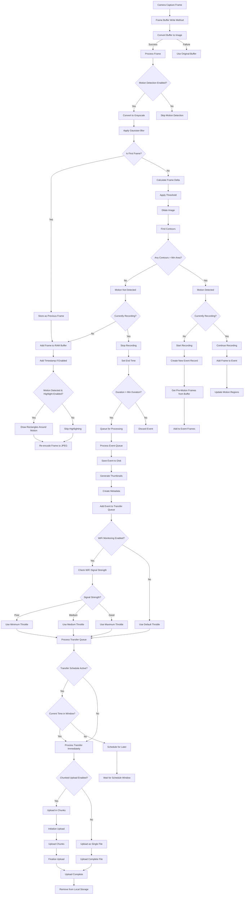

# Event Detection Control Flow

## Detailed Description of Event Detection Control Flow

### Frame Processing

1. **Camera Capture Frame**: Camera hardware captures a raw frame
2. **Frame Buffer Write Method**: The captured frame is passed to the buffer write method
3. **Convert Buffer to Image**: Convert JPEG buffer to OpenCV image format
   - **Success**: Continue to process frame
   - **Failure**: Use original buffer without processing

### Motion Detection

1. **Motion Detection Check**: Verify if motion detection is enabled
   - If disabled, skip motion detection

2. **Prepare Frame**:
   - Convert to grayscale
   - Apply Gaussian blur

3. **First Frame Check**:
   - If this is the first frame, store it as previous frame for future comparison
   - If not, continue with motion detection

4. **Calculate Differences**:
   - Compute absolute difference between current and previous frame
   - Apply threshold to highlight differences
   - Dilate image to fill holes
   - Find contours in the thresholded image

5. **Motion Detection Decision**:
   - Check if any contour is larger than minimum area
   - If yes, motion is detected
   - If no, no motion is detected

### Recording Control

1. **Motion Detected**:
   - If currently recording: Continue recording
   - If not currently recording: Start new recording

2. **No Motion Detected**:
   - If currently recording: Stop recording
   - If not recording: No action

3. **Start Recording Process**:
   - Create new event record with unique ID
   - Retrieve pre-motion frames from circular buffer (capturing what happened before motion)
   - Add these frames to the event

4. **Continue Recording Process**:
   - Add current frame to event
   - Update motion regions

5. **Stop Recording Process**:
   - Set event end time
   - Check if event duration exceeds minimum threshold
   - If duration is sufficient, queue for processing
   - If duration is too short, discard event

### Frame Enhancement

1. **Add to RAM Buffer**: Add frame to circular buffer for pre-motion capture
2. **Add Timestamp**: Add timestamp overlay if enabled
3. **Highlight Motion**: Draw rectangles around motion regions if enabled and motion detected
4. **Re-encode Frame**: Convert back to JPEG format for streaming

### Event Processing

1. **Process Event Queue**: Background worker thread processes recorded events
2. **Save Event to Disk**:
   - Create directory structure
   - Save video file
   - Generate thumbnails if enabled
   - Create metadata file

3. **Add to Transfer Queue**: Queue event for network transfer

### Transfer Process

1. **WiFi Signal Check**:
   - If WiFi monitoring enabled, check signal strength
   - Adjust transfer throttle based on signal quality:
     - Poor signal: Use minimum throttle
     - Medium signal: Use medium throttle
     - Good signal: Use maximum throttle

2. **Transfer Schedule Check**:
   - If schedule active, check if current time is within transfer window
   - If outside window, schedule transfer for later
   - If within window or schedule not active, process transfer immediately

3. **Transfer Method**:
   - If chunked uploads enabled:
     - Initialize upload with metadata
     - Upload chunks with throttling
     - Finalize upload
   - If not enabled:
     - Upload complete file with throttling

4. **Cleanup**:
   - When transfer completes successfully, remove from local storage