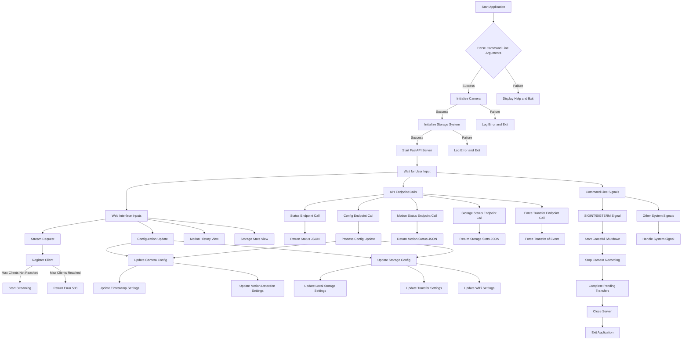

# User Input Control Flow

## Detailed Description of User Input Control Flow

### Initial Setup

1. **Start Application**: The application begins execution
2. **Parse Command Line Arguments**: The system parses arguments like resolution, frame rate, motion detection settings, etc.
   - **Success**: Continues with initialization
   - **Failure**: Displays help message and exits

3. **Initialize Camera**: Sets up the camera with configured settings
   - **Success**: Proceeds to initialize storage system
   - **Failure**: Logs error and exits

4. **Initialize Storage System**: Sets up local and remote storage components
   - **Success**: Starts FastAPI server
   - **Failure**: Logs error and exits

5. **Start FastAPI Server**: Initializes web server and endpoints

### User Input Sources

After initialization, the system waits for user input from three main sources:
- **Web Interface Inputs**: Actions taken through the browser UI
- **API Endpoint Calls**: Direct REST API calls
- **Command Line Signals**: SIGINT, SIGTERM, etc.

### Web Interface Inputs

1. **Stream Request**:
   - Checks if maximum client limit is reached
   - If limit not reached, registers client and starts streaming
   - If limit reached, returns 503 error

2. **Configuration Update**:
   - Camera configuration (timestamp, motion detection settings)
   - Storage configuration (local storage, transfer settings, WiFi settings)

3. **Motion History View**:
   - Displays recent motion events with timestamps

4. **Storage Stats View**:
   - Shows storage usage, pending transfers, and network status

### API Endpoint Calls

1. **Status Endpoint** (`/status`):
   - Returns camera and server status information

2. **Config Endpoint** (`/config`):
   - Processes configuration updates
   - Updates camera or storage settings

3. **Motion Status Endpoint** (`/motion_status`):
   - Returns current motion detection status and history

4. **Storage Status Endpoint** (`/storage/status`):
   - Returns storage usage statistics and pending transfers

5. **Force Transfer Endpoint** (`/storage/transfer/{event_id}`):
   - Forces immediate transfer of a specific motion event

### Command Line Signals

1. **SIGINT/SIGTERM**:
   - Triggers graceful shutdown sequence:
     - Stops camera recording
     - Completes pending transfers if possible
     - Closes server connections
     - Exits application

2. **Other System Signals**:
   - Handled according to system requirements

### Configuration Updates

1. **Camera Configuration**:
   - **Timestamp Settings**: Show/hide timestamp, position, color, size
   - **Motion Detection Settings**: Enable/disable, sensitivity, minimum area, highlighting

2. **Storage Configuration**:
   - **Local Storage Settings**: Path, maximum size
   - **Transfer Settings**: Enable/disable, throttle, scheduling
   - **WiFi Settings**: Signal monitoring, adaptive throttling

### Shutdown Sequence

1. **Stop Camera Recording**: Safely stops camera recording
2. **Complete Pending Transfers**: Attempts to finish active transfers
3. **Close Server**: Closes all connections and shuts down server
4. **Exit Application**: Terminates the application